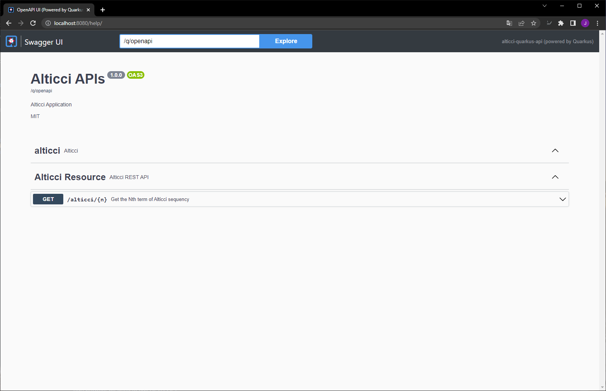

# Simple Quarkus Api
Simple Quarkus API is a project to test the Framework [quarkus.io](https://quarkus.io/). The README contains the basic instructions and commands that I used to run the project.

## Building and Running
Everything is already implemented and compiled, so we just need to build the image and run the container using the following commands:

~~~shell
docker-compose build
docker-compose up -d
~~~

## Endpoints
After the container is running you can use the API

### /alticci/{n}
This endpoint returns the Nth term of Alticci sequency. An example of use:

[http://localhost:8080/alticci/1](http://localhost:8080/alticci/1)

### /help
With this endpoint you can access the Swagger UI that is a documentation of the endpoints

[http://localhost:8080/help](http://localhost:8080/help)

